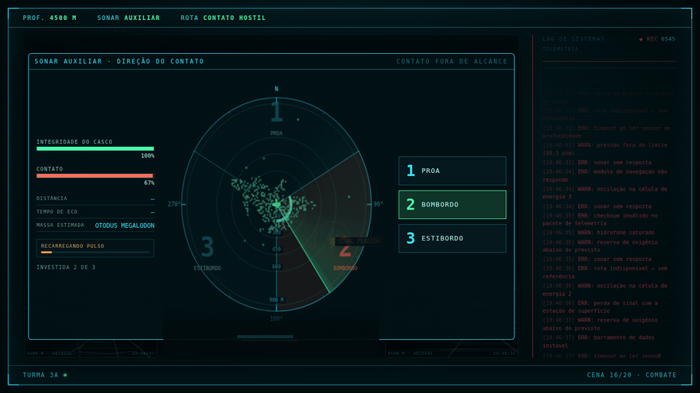
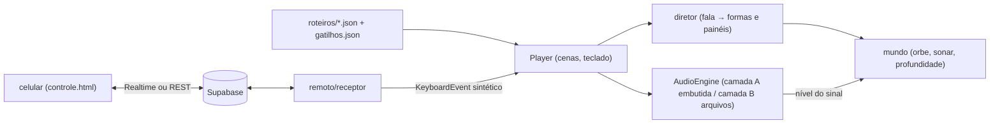

# Submarino DOMI

A "IA de bordo" de um submarino fictício: um sistema de apresentação
interativa que três turmas (2ºA, 2ºB e 3ºA) usaram na feira cultural da
escola em 2026, rodando offline num Chromebook gerenciado ligado ao projetor
— uma voz sintetizada narra a expedição, e um aluno-operador conduz tudo pelo
teclado ou pelo celular.



*(capturas em `docs/midia/` — enquanto `hero.gif` não é commitado, este
espaço fica esperando por ele)*

**Ao vivo:** [app](https://duque498.github.io/submarino-Dominante/app/) ·
[controle do celular](https://duque498.github.io/submarino-Dominante/controle.html)

## Por que é assim

Cada decisão de arquitetura deste projeto foi forçada por uma restrição real
do dia da feira. Esta tabela é o projeto inteiro em sete linhas:

| restrição | decisão que ela forçou |
|---|---|
| Chromebook **gerenciado** pela escola: não dá pra instalar nada | o app inteiro compila num único `dist/index.html` (vite-plugin-singlefile) aberto por `file://` — sem servidor, sem instalação, sem extensão |
| o wi-fi da escola é imprevisível e a apresentação não pode depender dele | **offline-first**: zero rede pra apresentar; até o `supabase-js` está vendorizado no repositório (`public/vendor/`, sha conferido contra o npm) |
| por `file://`, o Chrome trata `<audio>` como origem opaca e a Web Audio **não lê o sinal** — sem sinal, o orbe da IA não anima com a voz | duas camadas de áudio: os mp3 da voz embutidos em base64 (`audios.js`, camada A, com nível mensurável) e `<audio>` comum pros arquivos longos (camada B) |
| quem escreve e corrige as falas é a **professora**, não quem programa | o roteiro é JSON puro por turma (`src/roteiros/2a.json`…) e um dicionário `gatilhos.json` decide o que aparece na tela a partir das **palavras que a IA diz** — com validador que aponta erro em português |
| legenda e voz precisam bater sempre, fala após fala | TTS **determinístico e local** (kokoro-onnx): mesma frase → mesmos bytes, e os tempos de cada linha (`tempos.json`) saem medidos da própria geração — sincronia por medição, não por chute |
| o firewall da escola derruba `wss://` mas deixa HTTPS passar | o controle remoto tem **dois transportes**: Supabase Realtime primeiro e, se o canal não sobe, polling REST numa tabela — a troca é automática nos dois lados e o diagnóstico aparece no overlay do operador |
| o operador é um aluno, no escuro, na frente da plateia | uma tecla por ação, a "colinha" do próximo passo sempre na tela, e o celular como **segunda fonte de teclas** — o comando remoto vira um `KeyboardEvent` real e cai no mesmo listener do teclado físico, então nenhuma regra existe em dois lugares |

Uma oitava, de brinde: o Chrome só libera áudio depois de um gesto físico —
por isso existe uma tela de ativação separada do início da apresentação, e o
celular *não pode* dar esse primeiro toque.

## Arquitetura

O `Player` lê o roteiro JSON da turma e toca cena a cena; o `diretor` escuta
cada linha falada e, pelo `gatilhos.json`, decide que forma o orbe assume e
que painel abre; o `mundo` simula o que o sonar "vê" (bestiário, profundidade,
câmeras); o `AudioEngine` toca a voz pela camada A (embutida, com nível
mensurável que anima o orbe) e os sons longos pela camada B; e o `remoto`
mantém o canal com o celular por Realtime ou REST, entregando cada botão
apertado como uma tecla de verdade na janela. O `App`, acima de tudo isso, só
cuida do que vem antes: escolher a turma, destravar o áudio com o gesto
físico e segurar o standby até o operador dar o primeiro →.



## Como rodar

```bash
# desenvolvimento
npm install
npm run dev            # http://localhost:5173/?turma=2B

# build (gera dist/index.html único; audio/, audios.js e vendor/ vão junto)
npm run build

# gerar a voz da IA (precisa de ffmpeg no PATH; o modelo kokoro baixa na 1ª vez)
pip install -r scripts/requirements.txt
python3 scripts/gerar_audios.py              # todas as turmas
python3 scripts/gerar_audios.py --turma 2b   # só uma
# (no fim ele mesmo chama embutir_audios.py, que monta o public/audios.js)

# publicar: push na main dispara o Action que monta e sobe o GitHub Pages
git push origin main
```

**No Chromebook:** copie a pasta `dist/` inteira (pendrive serve), abra o
`index.html` no Chrome, tela cheia, aperte qualquer tecla pra destravar o
áudio — e o `→` inicia quando a turma estiver pronta.

**No celular:** abra o
[controle](https://duque498.github.io/submarino-Dominante/controle.html),
escolha a turma e digite o PIN de 4 dígitos que aparece na tela do
Chromebook. Pro fallback REST existir, rode uma vez o
[`docs/sinais.sql`](docs/sinais.sql) no SQL Editor do painel do Supabase.

## Editando o roteiro sem programar

As falas moram em `src/roteiros/2a.json`, `2b.json` e `3a.json` — cada cena é
um objeto com `id`, `tipo` (fala, quiz, combate…), o `audio` da fala e as
`linhas` da legenda. O [`gatilhos.json`](src/roteiros/gatilhos.json) é um
dicionário editável em português: *palavra que a IA diz → o que aparece na
tela* ("baleia" vira a silhueta de baleia no orbe, "sonar" abre o painel do
sonar). Mexeu numa fala, rode `python3 scripts/gerar_audios.py` pra voz e as
legendas se regerarem juntas; um roteiro com erro é apontado na tela, em
português, pelo validador embutido.

O manual completo de operação — cada cena, cada tecla, o que fazer quando
algo estoura no meio da apresentação — está em
[`docs/OPERACAO.md`](docs/OPERACAO.md).

## Créditos

- **Turmas 2ºA, 2ºB e 3ºA** e sua professora, donos do conteúdo: as falas da
  IA são texto pedagógico delas, não deste repositório.
- **[Claude Code](https://claude.com/claude-code)** como par de programação
  ao longo de todas as fases.
- **[kokoro-onnx](https://github.com/thewh1teagle/kokoro-onnx)** (voz neural
  local, motor padrão) e **[edge-tts](https://github.com/rany2/edge-tts)**
  (motor alternativo).
- **[Supabase](https://supabase.com)** (Realtime e PostgREST) como relay do
  controle remoto.

## Licença

[MIT](LICENSE).
